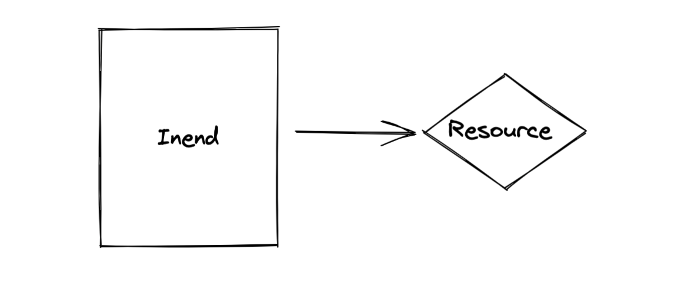
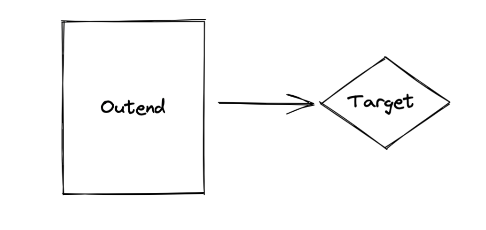

# 开发指南
## 源码导读
```
-> % tree
.
├── Dockerfile
├── Makefile
├── clocs.md
├── conf
│   └── banner.txt
├── go.mod
├── go.sum
├── main.go
├── pic
│   └── 1.png
├── plugin
│   ├── http_api_server.go
│   └── templates
│       └── dashboard.html
├── ppt.md
├── readme.md
├── statistics
│   └── statistic.go
├── test
│   ├── calllua_test.go
│   ├── input_data_select_test.go
│   ├── lua
│   │   ├── callback.lua
│   │   ├── data_to_mongo.lua
│   │   ├── mix_test.lua
│   │   └── sql_select.lua
│   ├── publish.sh
│   └── rulenginex_test.go
└── x
    ├── coap_resource.go
    ├── dblib.go
    ├── decodelib.go
    ├── encodelib.go
    ├── http_resource.go
    ├── in_end.go
    ├── interface.go
    ├── jqlib.go
    ├── kafka_target.go
    ├── mongo_target.go
    ├── mqtt_resource.go
    ├── mysql_target.go
    ├── out_end.go
    ├── protobuf_resource.go
    ├── rule.go
    ├── rule_cache.go
    ├── rulenginex.go
    ├── utils.go
    ├── xhook.go
    ├── xpipline.go
    └── xplugin.go

```
## 插件开发
插件接口

```go

type XPlugin interface {
	Load(*RuleEngine) *XPluginEnv
	Init(*XPluginEnv) error
	Install(*XPluginEnv) (*XPluginMetaInfo, error)
	Start(*RuleEngine, *XPluginEnv) error
	Uninstall(*XPluginEnv) error
	Clean()
}

```

## Hook开发
Hook接口
```go
type XHook interface {
	Work(inEndId string, data string) error
}

```

## InEnd开发

<div style="text-align:center;">
    
</div>

InEnd接口
```go

type inEnd struct {
	Id          string                  `json:"id"`
	State       TargetState             `json:"state"`
	Type        string                  `json:"type"`
	Name        string                  `json:"name"`
	Description string                  `json:"description"`
	Binds       *map[string]rule        `json:"-"`
	Config      *map[string]interface{} `json:"config"`
}

```

## OutEnd开发
OutEnd 接口
<div style="text-align:center;">
    
</div>

```go
type outEnd struct {
	Id          string                  `json:"id"`
	Type        string                  `json:"type"`
	State       TargetState             `json:"state"`
	Name        string                  `json:"name"`
	Description string                  `json:"description"`
	Config      *map[string]interface{} `json:"config"`
	Target      XTarget                 `json:"-"`
}

```