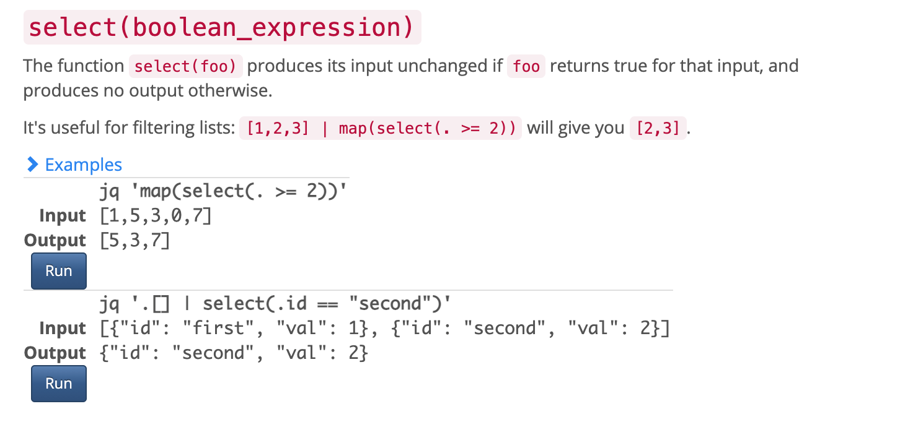

# 使用案例

## 利用树莓派实现温湿度监控
### 需求:
网关为树莓派，接受来自传感器的数据，数据上传后要求以下规则进行处理：
- 当温度大于 50 度时转发到 Kafka
- 当湿度小于 30 的时候保存进 MongoDb
- 当二氧化炭浓度大于30而且湿度小于 50 的时候保存到 Mysql
- 当光照强度大于500的时候将其替换成 0,然后交给下一个回调

其中数据结构如下:
```json
{
    "temp":0,
    "hum":0,
    "co2":0,
    "lex":0
}
```
### 编写规则
```lua
-- Success
function Success()
    print("success")
end
-- Failed
function Failed(error)
    print("failed:", error)
end

-- Actions
Actions = {
    function(data)
        local V = Select(".[] | select(.temp > 50)", data)
        if V ~=nil then
            dataToKafka("kafka001", V)
        end
        return true, data
    end,
    function(data)
        local V = Select(".[] | select(.hum < 30)", data)
        if V ~=nil then
            dataToMongo("mongo001", V)
        end
        return true, data
    end,
    function(data)
        local V = Select(".[] | select(.lex > 500)", data)
        if V ~=nil then
            dataToMysql("mysql001", V)
        end
        return true, data
    end,
    function(data)
        local V = Select(".[] | select(.co2 > 30) | select(.co2 < 50)", data)
        if V ~=nil then
            data["co2"] = 0
        end
        return true, data
    end,
    function(data)
        --
        return false, data
    end
}

```
> 可能大家对这种语法会感到困惑：`Select(".[] | select(.temp > 50)", data)`， 目前数据筛选使用的是 JQ，请大家事先学习一下 JQ 的筛选语法规则:https://stedolan.github.io/jq/manual

#### 主要用到的筛选函数

<div style="text-align:center;">
    
</div>
