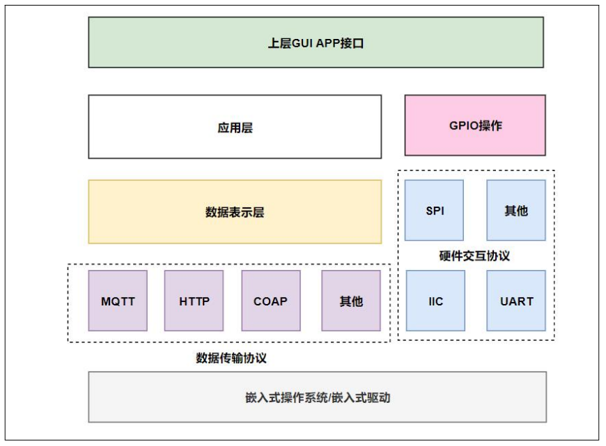
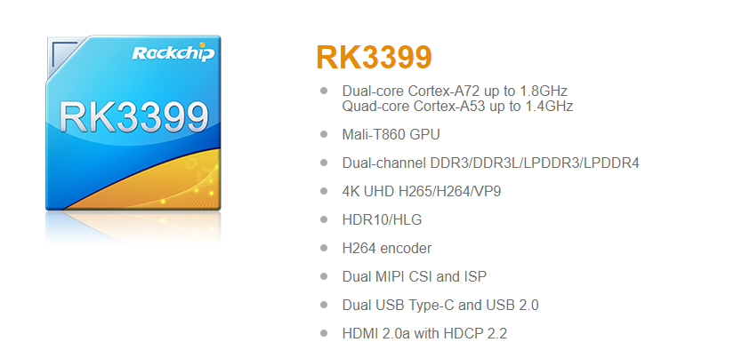

## RuleX Gateway 简介

​        RuleX Gateway 是Atomic团队专门为 Atomic+Rulex 定制的一款实体设备。采用RK3399六核（A72x2+A53x4）64位处理器，主频高达1.8GHz，集成四核Mali-T864 GPU，性能优异。板载M.2 PCIe 、4G LTE扩展接口、多种显示接口和通信串口。支持Android/Linux/Ubuntu系统，开放源代码方便企业二次开发。适用于带高清显示的商显广告机、自动售货机、教育终端等，可降低研发门槛，加速产品研发周期。

## 网关架构

    

## 功能特性
- 支持机器训练模型
- 支持数据流规则引擎
- 支持多协议数据接入
- 支持多协议数据中转
- 支持扩展开发

## 网关参数
网关主板采用 RK3399芯片：

    

| 项目   | 值                                                                                             |
| ------ | ---------------------------------------------------------------------------------------------- |
| CPU    | RK3399 6核 12线程，1.8GHz                                                                      |
| GPU    | Mali-T860 GPU, OpenGL ES1.1/2.0/3.0/3.1, OpenCL； Supports AFBC (ARM Frame Buffer Compression) |
| 内存   | 8GB                                                                                            |
| 硬盘   | 64GB                                                                                           |
| GPIO   | 18个GPIO，其中有两组 UART，一个SPI，一个IIC                                                    |
| 其他IO | 支持USB，RJ45 千兆网口                                                                         |

> 更多关于RK3399的参数: https://www.rock-chips.com/a/en/products/RK33_Series/2016/0419/758.html

## 实体价格

## 高配

单个售价：`￥3999`

## 中配

单个售价：`￥2999`

## 低配

单个售价：`￥999`