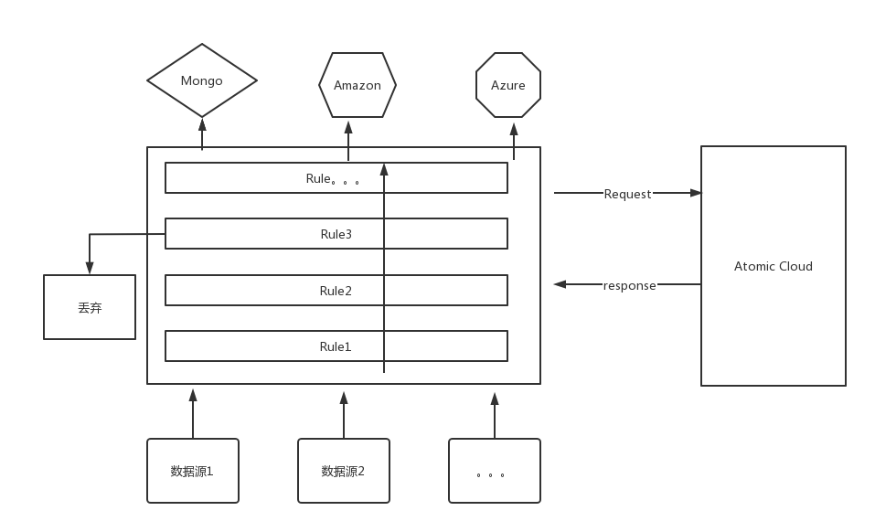

 <h1>RuleX: 轻量级物联网数据处理引擎</h1>

    

## 简介

RuleX 是一个轻量级规则引擎,主要用来中转上游数据和吐出数据到目标点，可以理解为一个数据路由器。主要被设计用来做物联网网关或者服务端存在数据筛选的场景。

## 架构
规则引擎本质上是个流处理器，数据被视为流，然后经过规则引擎后，被层层处理，最后交给回调函数处理,基础架构图如图所示:

    

## 场景
可用在灵活多变的数据处理场景下的嵌入式物联网网关，或者是服务器端。

    

## 功能
### 数据入口
- [X] MQTT 数据入口
- [ ] HTTP 数据入口
- [ ] COAP 数据入口
- [ ] UDP 数据入口
- [ ] GRPC 数据入口
- [ ] 串口输入
- [ ] CAN 输入
- [ ] ModBUS输入

### 特色功能
- LUA 自定义业务逻辑脚本支持
- JQ Select 支持用Jq来做字段筛选

### 数据出口
- [X] 数据持久化到 MongoDB
- [ ] 数据持久化到 Redis
- [ ] 数据持久化到 Mysql
- [ ] 数据转发 Kafka
- [ ] 数据转发 ActiveMQ

### 插件系统
规则引擎提供了插件机制，用户可自己编写插件来进行扩展应用功能，比如 RuleX的 dashboard 插件.

---
## 社区
- QQ群: 475512169
- 邮箱: cnwwhai@gmail.com; 751957846@qq.com
- 微信: bignullnull
---